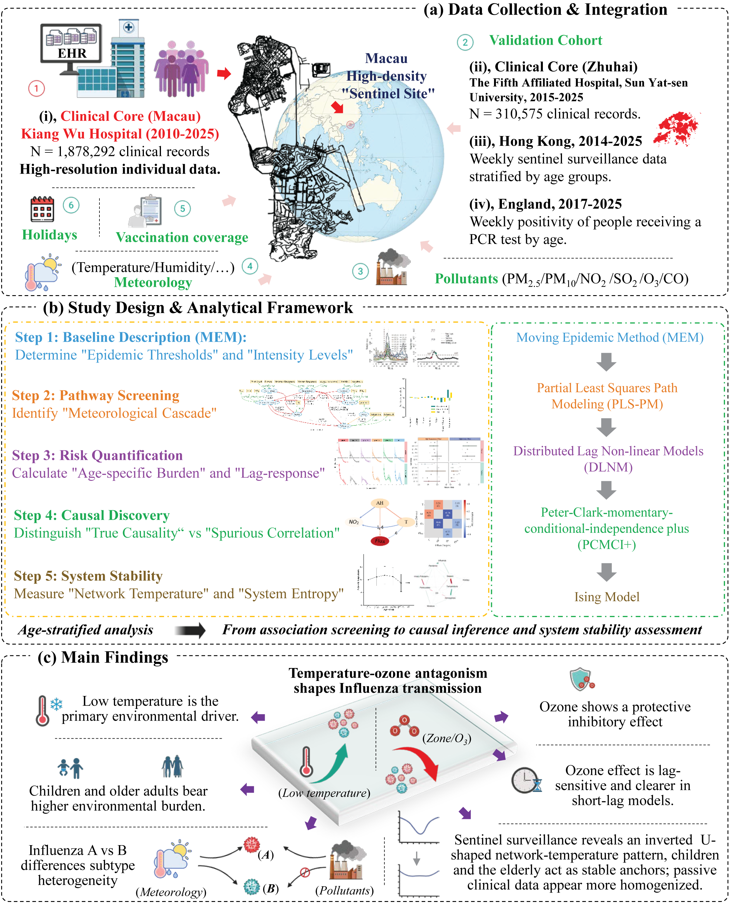

This repository includes R code to run all of the analysis for the paper "**Temperature–ozone antagonism shapes influenza transmission and reveals age-specific system stability: a multi-regional study integrating causal inference and network thermodynamics**" and to produce the main figures of the paper.

# Graphical Abstract



# Overview

**Background:** Seasonal influenza transmission is complex, yet its environmental determinants remain poorly characterized, including the paradoxical role of ozone relative to temperature, potential subtype-specific responses, and variation across demographic strata and between surveillance architectures. Here, we aimed to establish a unified causal framework to systematically screen environmental pathways, delineate the temperature–ozone antagonism, and evaluate how demographic and surveillance heterogeneity modulates these associations.

**Methods:** This retrospective longitudinal study integrated individual clinical records from Macau (1,878,292 subjects, 2010–2025) and Zhuhai (310,575 subjects, 2015–2025) with population-level active sentinel surveillance data from Hong Kong (2014–2025) and England (2017–2025). A progressive evidence chain advanced from Partial Least Squares Path Modeling (PLS-PM) for environmental pathway screening, through Distributed Lag Non-linear Models and the PCMCI+ algorithm for risk quantification and causal network reconstruction, to an Ising model framework estimating dynamical system stability and network temperature across age strata.

**Findings:** PLS-PM identified temperature and ozone as the primary antagonistic drivers of influenza transmission. Low temperatures imposed the greatest attributable burden on school-age children and adolescents. Conversely, higher ozone concentrations were causally associated with reduced influenza A activity across all age groups (RR at the 95th versus median ozone percentile: ranging from 0.428 (0.328–0.558) in children <6 years to 0.541 (0.401–0.731) in adults ≥65 years), an association independently confirmed as causal by PCMCI+ in Macau (*P* = 0.027), Hong Kong (*P* < 0.001) and Zhuhai (*P* = 0.006). This inhibitory ozone signal was highly lag-sensitive, detectable stably in short-lag models (≤4 weeks), and was specific to influenza A, whereas influenza B was governed predominantly by temperature. Ising model analysis of sentinel data revealed an inverted U-shaped network temperature trajectory across age groups, with children and older adults as environmentally constrained anchors with low network temperature, reflecting stronger deterministic environmental influence on their influenza dynamics.

**Interpretation**: The identified temperature–ozone antagonism reframes seasonal influenza epidemiology, revealing that low temperature broadly promotes transmission while ozone exerts an acute, subtype-specific inhibitory effect on influenza A. This constitutes a biological trade-off rather than a net public health benefit, arguing against relaxation of air quality standards and supporting integration of real-time ozone monitoring into subtype-resolved early warning systems. Children and older adults emerge as environmentally sensitive populations requiring targeted, weather-responsive interventions. The systematic divergence between passive clinical and active sentinel surveillance demonstrates that integrating both architectures is essential for accurate planetary health monitoring.

# Repo Contents

- [Scripts](./Scripts): R scripts for data processing, statistical modeling, and figure generation. *If not otherwise specified, this analysis is typically completed within a few minutes.*
+ `Anuual_counts_of_specimens.R`. Annual distribution and proportions of Influenza A, B, and Non-Influenza cases.
+ `DLNM_Flu_burden.R`. Quantifies the non-linear and delayed effects of ambient temperature and ozone on influenza burden across various age groups in four regions (Macau, Hong Kong, Zhuhai, and England) using Distributed Lag Nonlinear Models (DLNM).
+ `DLNM_validation.R`. Validates the non-linear and lagged associations between multiple environmental exposures (temperature, humidity, atmospheric pressure, and air pollutants) and weekly influenza risk across Macau, Hong Kong, and Zhuhai using Distributed Lag Nonlinear Models (DLNMs), alongside comprehensive sensitivity analyses to assess the robustness of these exposure-response relationships to varying lag structures.
+ `Flu_Temp_O3_Lag_Analysis.R`. Quantifies the delayed effects (up to 14 weeks) of temperature and ozone on weekly influenza cases in Hong Kong and Macau using adjusted partial correlation analyses to disentangle direct meteorological drivers from seasonal air quality signals.
+ `Macau_HK_synchrony_validation.R`. Evaluates the temporal synchrony of influenza activity and 15 environmental variables (meteorological and air quality) between Macau and Hong Kong, producing weekly time-series overlay plots, cross-regional concordance scatter plots with Pearson correlations, and summary descriptive statistics tables to establish the shared environmental context underlying both settings.
+ `Moving_epidemic_method.R`. Applies the Moving Epidemic Method (MEM) to retrospectively define influenza seasonal thresholds, epidemic periods, and intensity levels (medium, high, very high) for Influenza A and B in Macau, generating standardized epidemiological surveillance curves.
+ `Network_temperature.R`. Employs multigroup Ising models to map the complex interaction networks between influenza activity, meteorological conditions, and air pollutants across different age groups, identifying shared network topologies and quantifying age-specific “network temperatures” as a metric of environmental-system stochasticity.
+ `Ozone_influenza_DLNM_analysis.R` Applies DLNMs to disentangle the non-linear and delayed associations between ambient ozone and Influenza A incidence, generating primary figures (including a 3D exposure-lag-response surface and cumulative risk curves) alongside robust sensitivity analyses varying lag structures and adjusting for co-pollutants in Macau and Hong Kong.
+ `PCMCI+.py`. Employs the PCMCI+ causal discovery framework to identify time-lagged causal pathways between meteorological conditions, individual air pollutants, and influenza incidence across Macau, Hong Kong, and Zhuhai, generating publication-ready causal network graphs, heatmaps of maximum conditional dependence, and source data exports.
+ `PCMCI2+.py`. As a sensitivity analysis, this Python script utilizes the PCMCI+ causal discovery framework to evaluate whether incorporating sunshine duration alters the time-lagged causal pathways between meteorological variables, air pollutants, and influenza incidence, explicitly modeling sunshine as a purely exogenous driver based on physical constraints.
+ `PLS-PM.py`. Employs Partial Least Squares Path Modeling (PLS-PM) to quantify the direct, indirect, and total driving effects of meteorological conditions and air pollutants on influenza incidence, incorporating a lag-based sensitivity analysis to optimize the model’s predictive temporal scale.
+ `Table1.R`. Processes individual-level clinical surveillance data to generate a formatted baseline characteristics table (Table 1), summarizing Influenza A and B positivity rates across demographic and temporal strata alongside their corresponding chi-squared test statistics.

- [Figures](./Figures): High-resolution publication-ready figures in PDF format.

- [Tables](./Tables): Output tables and statistical summaries in Excel format.

- [data](./data):  Datasets and input files required to reproduce the analysis.


**Data availability**: The primary clinical dataset comprising electronic health records at the individual level is not publicly available due to patient privacy regulations and ethical restrictions regarding the protection of personal health information; however, anonymized data supporting the findings of this study may be made available to qualified researchers upon reasonable request to the corresponding authors, subject to approval by the institutional review board and the execution of a data sharing agreement. Publicly available datasets used for external validation and environmental analysis are available from the following repositories: aggregate weekly influenza surveillance data from the Centre for Health Protection, Hong Kong SAR (https://www.chp.gov.hk/files/xls/flux_data.xlsx); weekly positivity rates of individuals receiving PCR tests stratified by age in England from the UK Health Security Agency (https://ukhsa-dashboard.data.gov.uk/respiratory-viruses/influenza); meteorological and air quality data from the Macao Meteorological and Geophysical Bureau (https://www.smg.gov.mo); meteorological records from the Hong Kong government’s open data portal (https://data.gov.hk/) and environmental data from the Hong Kong Environmental Protection Department (https://cd.epic.epd.gov.hk/); meteorological parameters from the National Meteorological Science Data Center of China (https://data.cma.cn/) and air quality metrics from the National Urban Air Quality Real Time Publishing Platform for Zhuhai (https://air.cnemc.cn:18007/); global historical climatology network data provided by the National Centers for Environmental Information under the United States National Oceanic and Atmospheric Administration (https://www.ncei.noaa.gov/data/global-summary-of-the-day/archive/) and high resolution hourly air quality data from the Automatic Urban and Rural Network for England (https://uk-air.defra.gov.uk/). Additional contextual variables concerning public holiday schedules and coronavirus disease 2019 restriction timelines were retrieved from the respective official government public records. 

# System Requirements

All analyses were run in R (version 4.5.1) using the RStudio IDE (https://www.rstudio.com) or Python (version 3.9.12) using the Spyder IDE (https://www.spyder-ide.org) on a Windows 11 personal computer (16 GB RAM; Intel® Core™ i7-7700K processor).

```R
R version 4.5.2 (2025-10-31 ucrt) -- "[Not] Part in a Rumble"
Copyright (C) 2025 The R Foundation for Statistical Computing
Platform: x86_64-w64-mingw32/x64
```

```python
Python 3.9.12 (main, Apr  4 2022, 05:22:27) [MSC v.1916 64 bit (AMD64)]
```

# Installation 

**NOTE**: *We have tested the above steps on Windows 11 ; they should work similarly on Linux and macOS systems with a valid Docker installation.*

The installation time should be < 30 minutes total on a typical desktop computer.

To reproduce all analyses in the paper, please follow these steps:

**1. Clone the repository**

Open your terminal and navigate to the desired directory, then run:

```shell
git clone https://github.com/xingabao/influenza_temperature_ozone.git
```

## R

You can download and install R from CRAN: https://cran.r-project.org

You can download and install RStudio from their website: https://www.rstudio.com

**1. All R packages required to run the analyses are listed below**:

```R
suppressMessages(suppressWarnings(library(glue)))
suppressMessages(suppressWarnings(library(dplyr)))
suppressMessages(suppressWarnings(library(tidyr)))
suppressMessages(suppressWarnings(library(gtable)))
suppressMessages(suppressWarnings(library(ggplot2)))
suppressMessages(suppressWarnings(library(forcats)))
suppressMessages(suppressWarnings(library(grid)))
suppressMessages(suppressWarnings(library(gridExtra)))
suppressMessages(suppressWarnings(library(cowplot)))
suppressMessages(suppressWarnings(library(geomtextpath)))
suppressMessages(suppressWarnings(library(dlnm)))
suppressMessages(suppressWarnings(library(splines)))
suppressMessages(suppressWarnings(library(data.table)))
suppressMessages(suppressWarnings(library(patchwork)))
suppressMessages(suppressWarnings(library(mem)))
suppressMessages(suppressWarnings(library(lubridate)))
suppressMessages(suppressWarnings(library(mice)))
suppressMessages(suppressWarnings(library(qgraph)))
suppressMessages(suppressWarnings(library(psychonetrics)))
```

**2. Install R packages**

The following R packages are required. Please ensure they are installed before running the scripts. The versions used in this study are indicated in parentheses.

```R
glue                # 1.8.0
dplyr               # 1.2.0
tidyr               # 1.3.1
gtable              # 0.3.6
ggplot2             # 4.0.0
forcats             # 1.0.1
grid                # 4.5.2
gridExtra           # 2.3
cowplot             # 1.2.0
geomtextpath        # 0.2.0
dlnm                # 2.4.10
splines             # 4.5.2
data.table          # 1.17.8
patchwork           # 1.3.2
mem                 # 2.18
lubridate           # 1.9.4
mice                # 3.18.0
qgraph              # 1.9.8
psychonetrics       # 0.13.1
```

## Python

You can download and install Python from Python.org: https://www.python.org/

You can download and install Spyder from their website (optional): https://www.spyder-ide.org/

**1. All Python modules required to run the analyses are listed below**:

```R
import os
import numpy as np
import pandas as pd
import matplotlib.pyplot as plt
import matplotlib as mpl
import seaborn as sns
from matplotlib import rcParams
from statsmodels.tsa.seasonal import seasonal_decompose
from statsmodels.tsa.stattools import adfuller
from tigramite import data_processing as pp
from tigramite import plotting as tp
from tigramite.pcmci import PCMCI
from tigramite.independence_tests.parcorr import ParCorr
from plspm.plspm import Plspm
from plspm.config import Config, Structure, MV
from plspm.mode import Mode
from plspm.scheme import Scheme
import warnings
warnings.filterwarnings('ignore')


print(version('os'))
print(version('pandas')) 
print(version('requests'))  
```

**2. Install Python modules**

The following Python modules are required. Please ensure they are installed before running the scripts. The versions used in this study are indicated in parentheses.

```R
numpy                # 1.21.5
pandas               # 1.5.3
matplotlib           # 3.5.3
seaborn              # 0.11.2
statsmodels          # 0.13.2
tigramite            # 5.1.0.0
plspm                # 0.5.7
```

# Run the scripts

Execute the analysis scripts located in the [Scripts](./Scripts) directory. It is recommended to run them in the order listed in the **Repo Contents** section above to ensure data dependencies are met.

# License

This project is covered by the MIT license.